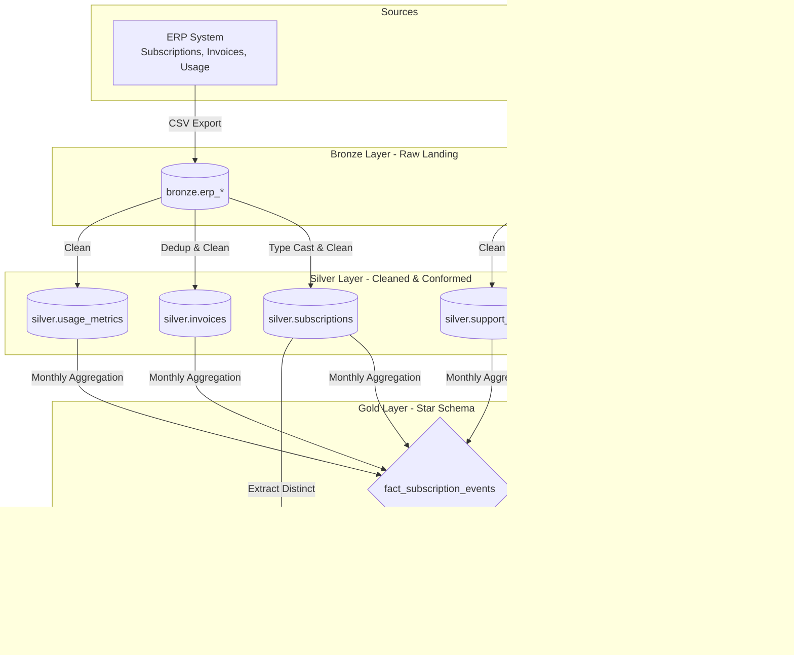

# Data Warehouse Architecture

This diagram visualizes the ETL/ELT pipeline from the raw source files through the different layers of our Medallion Architecture data warehouse.

```mermaid
flowchart TD
    subgraph Sources
        ERP[ERP System<br>Subscriptions, Invoices, Usage]
        CRM[CRM System<br>Accounts, Contacts, Tickets]
    end

    subgraph Bronze [Bronze Layer - Raw Landing]
        B_ERP[(bronze.erp_*)]
        B_CRM[(bronze.crm_*)]
    end

    subgraph Silver [Silver Layer - Cleaned & Conformed]
        S_Sub[(silver.subscriptions)]
        S_Inv[(silver.invoices)]
        S_Usage[(silver.usage_metrics)]
        S_Acc[(silver.accounts)]
        S_Cont[(silver.contacts)]
        S_Tick[(silver.support_tickets)]
    end

    subgraph Gold [Gold Layer - Star Schema]
        F_Events{fact_subscription_events}
        D_Cust[dim_customer]
        D_Plan[dim_plan]
        D_Date[dim_date]
    end

    ERP -->|CSV Export| B_ERP
    CRM -->|CSV Export| B_CRM
    
    B_ERP -->|Type Cast & Clean| S_Sub
    B_ERP -->|Dedup & Clean| S_Inv
    B_ERP -->|Clean| S_Usage
    
    B_CRM -->|Standardize| S_Acc
    B_CRM -->|Clean| S_Cont
    B_CRM -->|Clean| S_Tick
    
    S_Sub -->|Monthly Aggregation| F_Events
    S_Inv -->|Monthly Aggregation| F_Events
    S_Usage -->|Monthly Aggregation| F_Events
    S_Tick -->|Monthly Aggregation| F_Events
    
    S_Acc -->|SCD Type 1 Merge| D_Cust
    S_Sub -->|Extract Distinct| D_Plan
    
    F_Events --> D_Cust
    F_Events --> D_Plan
    F_Events --> D_Date
```
